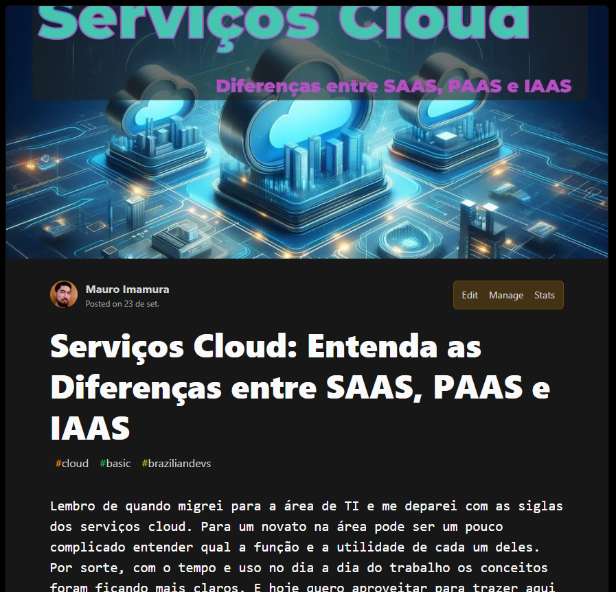

# dio-lab-artigo
--
Repo para entrega do desafio "Criando Artigos Técnicos com ChatGPT e Lexica.art" da dio.me
--
## Criação Do Material Base

### Assunto
    Serviços Cloud - SAAS, PAAS e IAAS

### Título Chamativo
    **prompt:**
    ```
        Atue como um escritor de artigos para blog de tecnologia e liste 10 ideias de títulos para um artigo sobre "Serviços Cloud - SAAS, PAAS e IAAS" para programadores iniciantes que precisam aprender os fundamentos sobre o assunto.

        {REGRAS}
        > Palavra-chave "Serviços Cloud" deve sempre aparecer no começo do título.
        > Usar menos de 10 palavras no título.
    ```

    *Resultado => Serviços Cloud: Entenda as Diferenças entre SAAS, PAAS e IAAS*

### Imagem de Capa Chamativa
   Criada com Microsoft Design

### Definir Assunto e Blocos do Artigo
    **prompt:**
    ```
        Atue como um escritor de artigos para blog de tecnologia e escreva um artigo sobre "Serviços Cloud - SAAS, PAAS e IAAS" para programadores iniciantes que precisam aprender os funtamentos sobre o assunto. Usar elementos de {RESUMO} para gerar o {ROTEIRO} de acordo com as {REGRAS}. O título é "Serviços Cloud: Entenda as Diferenças entre SAAS, PAAS e IAAS".

        {RESUMO}
        [autoridade]: Mauro, desenvolvedor com conhecimento em serviços cloud
        [avatar]: estudantes de programação
        [problema]: O que é CLOUD/COMPUTAÇÃO EM NUVEM, quais os tipos de serviços, quais as diferenças entre eles, para que servem cada um deles.

        {ROTEIRO}
        Apresentar [Autoridade] (apenas nome e cargo) e ensinar [avatar] sobre os fundamentos e conceitos básicos de [problema].

        {REGRAS}
        > Seguir o {ROTEIRO} acima e substituir os elementos entre [ ] do {ROTEIRO} por aqueles listados no {RESUMO}
        > Manter o tom e ritmo, mas reescrever palavras e expressões em {ROTEIRO} para que seja diferente do original, expandindo e mudando conforme necessário.
        > Usar analogias, comparação e metáforas.
        > Usar linguagem simples mas aplicar os termos técnicos necessários.
        > Explicar termos técnicos com descrições curtas entre vírgulas ou parênteses.
        > Dar exemplos de uso de cada serviço em situações reais de um desenvolvedor de sistemas.
        > Dar exemplos de empresas que oferecem serviços cloud e citar seus produtos.
    ```
--
## Resultado
[Artigo publicado(↗)](https://dev.to/mauroimamura/servicos-cloud-entenda-as-diferencas-entre-saas-paas-e-iaas-3jep)
